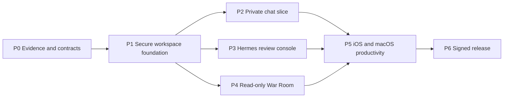

# ThoxWarRoom Multi-Team Development Queue

Last updated: 2026-08-23

## Team topology

| Team | Ownership | May merge when |
|---|---|---|
| Team Core | Shared Swift package, domain models, persistence, transport, workspace identity, audit | Contract, unit, migration, and egress-policy tests pass |
| Team iOS | iPhone navigation, auth UX, chat UI, share extension, App Intents, device QA | Core APIs are versioned; simulator and physical-device flows pass |
| Team macOS | Windowing, sidebar, chat/War Room UI, Spotlight, packaging | Core APIs are versioned; app sandbox and runtime flows pass |
| Team Hermes/War Room | Hermes adapters, approvals, jobs, workspace browser, fleet/mesh/route adapters | Backend fixtures and live private-environment contract tests pass |
| Team Security/QA/Release | Threat tests, accessibility, privacy manifest, CI, signing, notarization, TestFlight | Independent release matrix and clean-device smoke pass |

Team Core defines interfaces; platform teams own presentation and OS integration; feature teams provide adapters/use cases; Security/QA owns independent gates. No team may bypass the shared workspace and audit boundaries.

## Dependency sequence

## Active backlog

| ID | Priority | Status | Owner | Files/modules affected | Acceptance criteria | Tests | Security/docs | Next action |
|---|---:|---|---|---|---|---|---|---|
| WR-000 | 9.6 | Ready | Architecture + owner/legal | License inventory and product baseline | Written choice: clean-room MIT native implementation or GPL distribution; protected v4.1 reference rules | License/source provenance scan | ADR and notices | Approve the licensing baseline |
| WR-001 | 9.4 | Blocked by WR-000 | Core + Hermes | New `Packages/WarRoomCore`; independent service fixtures | Versioned Open WebUI/Hermes/War Room contracts captured from current services without copying legacy implementation | Codable fixtures, malformed input, stream cancellation | Redacted fixtures; ADR update | Capture sanitized request/response fixtures |
| WR-002 | 9.2 | Ready | Core + Security | Workspace profile, Keychain, transport policy | Create/edit/test/delete local/private profile; no hard-coded destination; explicit hosted opt-in | Scheme/host/redirect, Keychain, egress deny tests | Update security model/data-flow | Define profile schema and threat cases |
| WR-003 | 8.8 | Blocked by WR-002 | Core | Encrypted workspace store, migrations, audit | Workspace isolation, deletion/export, crash-safe migration | Migration, corruption, cross-workspace tests | Retention and audit schema | Select platform storage primitives without cloud dependency |
| WR-004 | 8.5 | Blocked by WR-001/2/3 | Core + iOS + macOS | Native chat and streaming | Authenticate, select model, stream/cancel/retry, persist/relaunch, cite sources | Contract, UI, offline/reconnect, cancellation | Sensitive-log redaction | Implement one end-to-end local-provider path |
| WR-005 | 8.7 | Blocked by WR-001/2 | Hermes + Security | Sessions, jobs, approvals, audit | Observe live session; approve/deny scoped action; reject expired/replayed approval | Fixture, live contract, replay, injection | Approval protocol ADR | Implement read-only session stream first |
| WR-006 | 8.1 | Blocked by WR-001/2 | Hermes/War Room | Fleet, mesh, route, alert adapters | Provenance, last-updated, stale/error/empty states against real endpoints | Adapter fixtures, timeout, partial failure | Avoid device identifiers in logs | Normalize health contracts |
| WR-007 | 7.8 | Blocked by WR-003/5 | Hermes + platform | Read-only workspace browser | Search/view within root; no traversal or symlink escape | Path fuzz, symlink, size, encoding | Root policy and audit | Port v4.1 path-policy cases |
| WR-008 | 7.5 | Blocked by WR-004/5 | iOS | Share extension, App Intents, deep links | Share text/file into selected workspace with preview and confirmation | Extension lifecycle, locked Keychain, deep-link validation | Privacy manifest/data sharing | Ship one share-to-draft flow |
| WR-009 | 7.4 | Blocked by WR-004/5 | macOS | Sidebar, commands, Spotlight window | Multi-window lifecycle, keyboard access, no action bypass | UI, focus, relaunch, sandbox | Accessibility and audit | Ship native sidebar and command routing |
| WR-010 | 9.0 | Unsigned PR CI implemented; release gates remain | Security/QA/Release | `.github/workflows`, scripts, manifests | Every PR runs deterministic generation, macOS tests, and generic iOS Simulator build without secrets; signed release evidence remains separate | Local clean-clone bootstrap and GitHub `macos-26` lane | Read-only workflow permissions; no signing/upload/notarization in PR CI | Add SBOM/privacy-manifest gates, then retain live signed release evidence separately |
| WR-011 | 8.0 | Implemented 2026-08-23 | Core + platform | Current `WKWebView` compatibility shell | Exact-host HTTPS in-app policy; only safe user-activated external links; automatic redirect denial; confirmed sign-out purge with explicit state | Navigation matrix plus injected persistent-store purge/state tests; macOS tests and iOS Simulator build | Temporary hosted boundary documented; workspace-scoped stores remain WR-002/003 | Re-verify live authentication/sign-out on physical iPhone and packaged Mac |
| WR-012 | 7.2 | Implemented 2026-08-23 | Release | `.tools`, bootstrap scripts, README | One command checksum-verifies repository-local XcodeGen 2.46.0 and validates a clean clone without global installation | `scripts/bootstrap.sh`; cached-version and archive-digest checks | Tool directory ignored; HTTPS-only download; pinned release digest | Re-run bootstrap on a second clean host when available |
| WR-013 | 8.6 | Implemented; ASC record pending | iOS + Release | `Assets.xcassets`, icon generator, upload script | Catalog validates without warnings; documented ASC variables match; signed archive and IPA export succeed | Validator and direct `actool` checks pass; generic Simulator test build passes; exported IPA signature/provisioning verified | Key remains external with mode 600; validation suppresses bearer token output | Create the App Store Connect app record for `ai.thox.warroom`, then rerun upload and verify processing/install |
| WR-014 | 9.1 | Implemented; live signing pending | macOS + Release | `scripts/build_macos.sh`, release docs | Developer ID signing; no `get-task-allow`; staple before final staging; final DMG app passes Gatekeeper | Script now gates on `codesign`, `stapler`, `spctl`, checksum; credential-free unsigned packaging validated locally | No secrets in arguments; Keychain notary profile only | Run with Developer ID identity and `NOTARY_PROFILE`, then retain final validation output as release evidence |

## Milestones and evidence gates

### Milestone 0 — Baseline and contracts

- Preserve `v4.1.0` as read-only reference.
- Record the license/product decision before reusing any legacy implementation.
- Produce sanitized fixtures for current Hermes/Open WebUI/War Room endpoints.
- Restore CI for unsigned builds and tests.
- Harden the compatibility shell's URL and data-clearing policies.

Exit evidence: clean clone builds both targets; contract fixtures pass; no source secret scan findings.

### Milestone 1 — Secure workspace foundation

- Workspace onboarding and explicit local/private/hosted labels.
- Keychain credential storage, scoped transport, local encrypted persistence, audit schema.
- Offline, timeout, certificate, and recovery UX.

Exit evidence: real private endpoint connection, restart persistence, deletion/export, cross-workspace isolation, and egress-deny tests.

### Milestone 2 — Usable native app

- One complete chat workflow on both platforms.
- Hermes read-only sessions plus approval/denial.
- Read-only War Room dashboard.

Exit evidence: physical iPhone and packaged Mac complete authenticated workflows against current private services with provenance and audit records.

### Milestone 3 — Platform depth

- iOS share-to-draft and App Intent.
- macOS sidebar, commands, and Spotlight experience.
- Read-only workspace browser; memories and insights backed by local stores.

Exit evidence: accessibility, locked-device, relaunch, network interruption, and workspace boundary suites pass.

### Milestone 4 — Distribution

- Privacy manifest, support/privacy/security docs, SBOM, signed provenance.
- TestFlight upload/install and notarized/stapled universal macOS DMG.
- Clean-device, upgrade, rollback, sign-out/purge, and offline smoke tests.

Exit evidence: App Store Connect processing succeeds, Gatekeeper accepts the DMG, and independent release checklist is signed off.

## Definition of done

“iOS and macOS app complete” means both apps perform the agreed private chat, Hermes review, and War Room workflows against current services; protect and delete local data as documented; pass automated and physical-device tests; and have verified TestFlight/notarized distribution evidence. A compiling target, hosted web page, screenshot, listener, DMG file, or unit-test pass alone is not sufficient.
