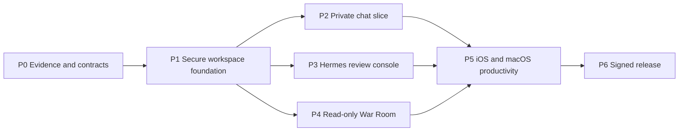

# ThoxWarRoom Multi-Team Development Queue

Last updated: 2026-08-23

## Team topology

| Team | Ownership | May merge when |
|---|---|---|
| Team Core | Shared Swift package, domain models, persistence, transport, workspace identity, audit | Contract, unit, migration, and egress-policy tests pass |
| Team iOS | iPhone navigation, auth UX, chat UI, share extension, App Intents, device QA | Core APIs are versioned; simulator and physical-device flows pass |
| Team macOS | Windowing, sidebar, chat/War Room UI, Spotlight, packaging | Core APIs are versioned; app sandbox and runtime flows pass |
| Team Hermes/War Room | Hermes adapters, approvals, jobs, workspace browser, fleet/mesh/route adapters | Backend fixtures and live private-environment contract tests pass |
| Team Security/QA/Release | Threat tests, accessibility, privacy manifest, CI, signing, notarization, TestFlight | Independent release matrix and clean-device smoke pass |

Team Core defines interfaces; platform teams own presentation and OS integration; feature teams provide adapters/use cases; Security/QA owns independent gates. No team may bypass the shared workspace and audit boundaries.

## Dependency sequence

## Active backlog

| ID | Priority | Status | Owner | Files/modules affected | Acceptance criteria | Tests | Security/docs | Next action |
|---|---:|---|---|---|---|---|---|---|
| WR-000 | 9.6 | Ready | Architecture + owner/legal | License inventory and product baseline | Written choice: clean-room MIT native implementation or GPL distribution; protected v4.1 reference rules | License/source provenance scan | ADR and notices | Approve the licensing baseline |
| WR-001 | 9.4 | Public/current-source contracts captured; authenticated live fixtures pending | Core + Hermes | `docs/current_service_contracts.md`; sanitized public fixture; provider packages | Open WebUI public behavior and current Hermes/War Room source contracts captured without copying legacy implementation | Provider Codable fixtures, malformed input, stream cancellation | Sanitized fixture; observed/source/unverified labels | Capture authenticated non-production fixtures after a test account/private environment is available |
| WR-002 | 9.2 | Native provider selection and workspace-scoped credential lifecycle implemented; live endpoint evidence pending | Core + Security + platform | `Packages/WarRoomCore`; `Packages/WarRoomAppleInfrastructure`; `App/WorkspaceOnboarding*`; `App/WorkspaceFeatureHosts.swift` | Validated boundary/consent; metadata-only profile persistence; workspace-scoped non-sync Keychain vault; exact-origin cookie/cache-free transport | 17 Core + 15 infrastructure tests; provider/lifecycle app tests; integrated macOS 43/43 and generic iOS test build pass | README, ADR-004/005, security boundary, privacy-sensitive credential fields | Verify Open WebUI and Hermes authentication against controlled private endpoints; add DNS rebinding defense |
| WR-003 | 8.8 | Encryption/migration, crash-safe retention/export, operation reconciliation, rollback anchoring, cross-process serialization, and resumable deletion implemented; app policy wiring pending | Core + Apple | Encrypted profile/audit/operation stores; lifecycle generations; Keychain anchors/lock/journal; onboarding lifecycle | Ciphertext isolation, redaction, tamper/rollback/deletion detection, cooperative writer serialization, bounded pages/export/reconciliation, credential-first resumable erasure | 38 Core + 88 Apple infrastructure tests; integrated app pipeline pass | Device-only keys, complete iOS protection, backup exclusion; advisory cooperative locks, raw UUID routing, no scheduler/UI or external signature | Add app policy persistence/scheduling, background recovery, opaque routing, and external anchoring if required |
| WR-004 | 8.5 | Discovery/model adapter and strict offline fail-closed chat evidence qualifier implemented | Core + iOS + macOS | `Packages/WarRoomOpenWebUI`; native chat and streaming | Public discovery/model catalog are bounded; chat capability remains disabled until nine authenticated credential/request/response/stream/cancellation/error/history/citation evidence categories qualify | 22 warnings-as-errors tests; current manifest is valid with 0 captured/9 missing and qualification exits 2 | Bounded text-only artifacts, path/hash/size/symlink/redaction checks; no guessed DTOs | Run one sanctioned authenticated non-production capture session, sanitize/review it, then implement the qualified typed contract |
| WR-005 | 8.7 | Read-only Hermes review, encrypted audited-operation persistence/reconciliation, and fail-closed human mutation review implemented; transport actions remain disabled | Hermes + Security | `Packages/WarRoomHermes`; Core operation contracts; Apple encrypted operation store/Keychain commitment; `App/HermesRunReview*` | Durable intent before transport; global replay rejection; no automatic retry; bounded outcome or explicit indeterminate state; pending/terminal crash reconciliation; exact reviewed context and second confirmation | 32 Hermes, 38 Core, 88 Apple infrastructure, and 80 integrated app tests; live/reconnect/authorization evidence pending | Production host injects no executor and reports authorization unavailable; URLProtocol evidence is not live-provider proof | Verify workspace authorization and capture the sanctioned live mutation contract, then compose the existing store/coordinator/UI without weakening fail-closed gates |
| WR-006 | 8.1 | Native read-only Mesh dashboard implemented; live contract evidence pending | Hermes/War Room | `Packages/WarRoomMesh`; `App/WarRoomDashboard*`; future route/alert adapters | Credential and canonical MeshID gates; devices/topology/events; provenance, freshness, stale/error/empty/partial states | 13 package tests + 8 dashboard model/service + 7 routing tests; synthetic/offline evidence only | Mesh IDs and credentials excluded from errors; no control-plane mutations | Capture a sanctioned private Mesh gateway session and complete physical iPhone/packaged-Mac verification |
| WR-007 | 7.8 | Implemented locally; physical picker proof pending | Hermes + platform | Read-only workspace browser | Operator-selected local root; no traversal/symlink following; bounded safe text preview; no writes/network | 7 filesystem confinement + 6 app model/eligibility tests; macOS/iOS builds | Root provenance visible; non-persisted selection; local-device boundary only | Manually exercise iOS/macOS picker/security-scope lifecycle, then consider persisted bookmarks |
| WR-008 | 7.5 | Blocked by WR-004/5 | iOS | Share extension, App Intents, deep links | Share text/file into selected workspace with preview and confirmation | Extension lifecycle, locked Keychain, deep-link validation | Privacy manifest/data sharing | Ship one share-to-draft flow |
| WR-009 | 7.4 | Blocked by WR-004/5 | macOS | Sidebar, commands, Spotlight window | Multi-window lifecycle, keyboard access, no action bypass | UI, focus, relaunch, sandbox | Accessibility and audit | Ship native sidebar and command routing |
| WR-010 | 9.0 | Implemented locally; GitHub billing blocked | Security/QA/Release | `.github/workflows`, pinned bootstrap, unsigned CI, SPDX generator, tracked-source secret scanner | Every PR regenerates deterministically, inventories dependencies, scans tracked source, tests every package with warnings as errors, and builds/tests both targets without release secrets | 193 package tests, 80 integrated macOS tests, 7 Python tests, deterministic assets/project, generic iOS Simulator test build all pass locally | XCTest-only package runners are regenerated per toolchain; workflow has read-only contents permission and no signing/upload/notary operations | Unlock GitHub billing and rerun; remote jobs stop before all steps with the account-lock annotation |
| WR-011 | 8.0 | Policy implemented; user route disabled pending privacy contract | Core + platform | Current `WKWebView` compatibility shell | Exact-host HTTPS policy and purge behavior remain tested; no user-facing route while retention/embedded domains are unverified | Navigation matrix, injected persistent-store purge/state tests, and disabled-route regression | Prevents an unsupported no-collection claim; workspace-scoped stores remain WR-002/003 | Verify hosted retention, embedded domains, privacy policy/labels, then re-enable only with physical-device evidence |
| WR-012 | 7.2 | Implemented 2026-08-23 | Release | `.tools`, bootstrap scripts, README | One command checksum-verifies repository-local XcodeGen 2.46.0 and validates a clean clone without global installation | `scripts/bootstrap.sh`; cached-version and archive-digest checks | Tool directory ignored; HTTPS-only download; pinned release digest | Re-run bootstrap on a second clean host when available |
| WR-013 | 8.6 | iOS and macOS TestFlight builds valid and assigned internally; physical install pending | iOS + macOS + Release | App Store Connect record, `Assets.xcassets`, privacy/export declarations, validators, upload scripts | Catalog/privacy/entitlement validate; both signed artifacts process as valid and are assigned to an internal group | iOS/macOS build 2 for version 4.2.0 are `VALID` and ready for internal beta; THOX admin invited | API key remains external; export compliance recorded as no non-exempt encryption; direct notarized DMG is separate | Accept the tester invitation and complete physical iPhone/Mac install, launch, authentication, relaunch, and removal checks |
| WR-014 | 9.1 | Implemented; live signing pending | macOS + Release | `scripts/build_macos.sh`, release docs | Developer ID signing; no `get-task-allow`; staple before final staging; final DMG app passes Gatekeeper | Script uses checksum-pinned XcodeGen and gates on `codesign`, `stapler`, `spctl`, checksum; credential-free unsigned packaging validated locally | No secrets in arguments; Keychain notary profile only | Run with Developer ID identity and `NOTARY_PROFILE`, then retain final validation output as release evidence |
| WR-015 | 8.8 | Shared record and native macOS TestFlight delivery proven; physical install pending | macOS + Release | `scripts/build_macos_appstore.sh`, SPDX SBOM, metadata worksheet, App Store Connect record | Automatic App Store signing, sandbox/no-debug validation, signed `.pkg`, API-key upload and internal assignment | Apple Distribution app and 3rd Party Mac Developer Installer package verified; build 2 reached `VALID` and internal readiness | API key remains external; no Developer ID/notary or physical-install claim | Upload build 3 from final source, assign internally, then complete invited-tester Mac install/launch/relaunch checks |

## Milestones and evidence gates

### Milestone 0 — Baseline and contracts

- Preserve `v4.1.0` as read-only reference.
- Record the license/product decision before reusing any legacy implementation.
- Produce sanitized fixtures for current Hermes/Open WebUI/War Room endpoints.
- Restore CI for unsigned builds and tests.
- Harden the compatibility shell's URL and data-clearing policies.

Exit evidence: clean clone builds both targets; contract fixtures pass; no source secret scan findings.

### Milestone 1 — Secure workspace foundation

- Workspace onboarding and explicit local/private/hosted labels.
- Keychain credential storage, scoped transport, local encrypted persistence, audit schema.
- Offline, timeout, certificate, and recovery UX.

Exit evidence: real private endpoint connection, restart persistence, deletion/export, cross-workspace isolation, and egress-deny tests.

### Milestone 2 — Usable native app

- One complete chat workflow on both platforms.
- Hermes read-only sessions plus approval/denial.
- Read-only War Room dashboard.

Exit evidence: physical iPhone and packaged Mac complete authenticated workflows against current private services with provenance and audit records.

### Milestone 3 — Platform depth

- iOS share-to-draft and App Intent.
- macOS sidebar, commands, and Spotlight experience.
- Read-only workspace browser; memories and insights backed by local stores.

Exit evidence: accessibility, locked-device, relaunch, network interruption, and workspace boundary suites pass.

### Milestone 4 — Distribution

- Privacy manifest, metadata worksheet, and deterministic SPDX SBOM are implemented; final screenshots, answers, and signed provenance remain.
- iOS and native macOS TestFlight upload/install plus notarized/stapled universal macOS DMG.
- Clean-device, upgrade, rollback, sign-out/purge, and offline smoke tests.

Exit evidence: App Store Connect processing succeeds, Gatekeeper accepts the DMG, and independent release checklist is signed off.

## Definition of done

“iOS and macOS app complete” means both apps perform the agreed private chat, Hermes review, and War Room workflows against current services; protect and delete local data as documented; pass automated and physical-device tests; and have verified TestFlight/notarized distribution evidence. A compiling target, hosted web page, screenshot, listener, DMG file, or unit-test pass alone is not sufficient.
