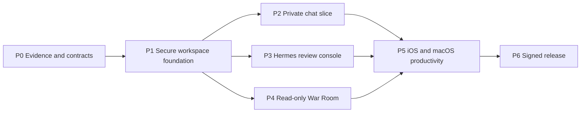

# ThoxWarRoom Multi-Team Development Queue

Last updated: 2026-08-25

## Team topology

| Team | Ownership | May merge when |
|---|---|---|
| Team Core | Shared Swift package, domain models, persistence, transport, workspace identity, audit | Contract, unit, migration, and egress-policy tests pass |
| Team iOS | iPhone navigation, auth UX, chat UI, share extension, App Intents, device QA | Core APIs are versioned; simulator and physical-device flows pass |
| Team macOS | Windowing, sidebar, chat/War Room UI, Spotlight, packaging | Core APIs are versioned; app sandbox and runtime flows pass |
| Team Hermes/War Room | Hermes adapters, approvals, jobs, workspace browser, fleet/mesh/route adapters | Backend fixtures and live private-environment contract tests pass |
| Team Security/QA/Release | Threat tests, accessibility, privacy manifest, CI, signing, notarization, TestFlight | Independent release matrix and clean-device smoke pass |

Team Core defines interfaces; platform teams own presentation and OS integration; feature teams provide adapters/use cases; Security/QA owns independent gates. No team may bypass the shared workspace and audit boundaries.

## Dependency sequence

## Active backlog

| ID | Priority | Status | Owner | Files/modules affected | Acceptance criteria | Tests | Security/docs | Next action |
|---|---:|---|---|---|---|---|---|---|
| WR-000 | 9.6 | Ready | Architecture + owner/legal | License inventory and product baseline | Written choice: clean-room MIT native implementation or GPL distribution; protected v4.1 reference rules | License/source provenance scan | ADR and notices | Approve the licensing baseline |
| WR-001 | 9.4 | Public/current-source contracts captured; authenticated live fixtures pending | Core + Hermes | `docs/current_service_contracts.md`; sanitized public fixture; provider packages | Open WebUI public behavior and current Hermes/War Room source contracts captured without copying legacy implementation | Provider Codable fixtures, malformed input, stream cancellation | Sanitized fixture; observed/source/unverified labels | Capture authenticated non-production fixtures after a test account/private environment is available |
| WR-002 | 9.2 | Native provider selection and workspace-scoped credential lifecycle implemented; live endpoint evidence pending | Core + Security + platform | `Packages/WarRoomCore`; `Packages/WarRoomAppleInfrastructure`; `App/WorkspaceOnboarding*`; `App/WorkspaceFeatureHosts.swift` | Validated boundary/consent; metadata-only profile persistence; workspace-scoped non-sync Keychain vault; exact-origin cookie/cache-free transport | 17 Core + 15 infrastructure tests; provider/lifecycle app tests; integrated macOS 43/43 and generic iOS test build pass | README, ADR-004/005, security boundary, privacy-sensitive credential fields | Verify Open WebUI and Hermes authentication against controlled private endpoints; add DNS rebinding defense |
| WR-003 | 8.8 | Encryption/migration, multi-workspace selection/deletion, crash-safe retention/export, policy persistence/UI, operation reconciliation, rollback anchoring, cross-process serialization, and resumable deletion implemented; automatic scheduling remains absent | Core + Apple | Encrypted profile/audit/policy/operation stores; lifecycle generations; Keychain anchors/lock/journal; native Audit Center; onboarding lifecycle | Ciphertext isolation, explicit verified selection, isolated fallback after active deletion, redaction, tamper/rollback/deletion detection, cooperative writer serialization, explicit confirmed retention, bounded pages/export/reconciliation, credential-first resumable erasure | 48 Core + 99 Apple infrastructure tests; 97 integrated macOS tests; generic dual-architecture iOS Simulator test build passes | Device-only keys, complete iOS protection, backup exclusion; advisory cooperative locks, raw UUID routing, no automatic scheduler or external signature | Validate multi-workspace/Audit Center flows on physical TestFlight devices, then add background recovery, opaque routing, and external anchoring if required |
| WR-004 | 8.5 | Discovery/model adapter, strict offline fail-closed chat evidence qualifier, and native block presentation surface (WR-017) implemented; live transport remains fail-closed | Core + iOS + macOS | `Packages/WarRoomOpenWebUI`; native chat and streaming; `App/WarRoomChat*` preview surface consumes the same `nativeChatContract` gate | Public discovery/model catalog are bounded; chat capability remains disabled until nine authenticated credential/request/response/stream/cancellation/error/history/citation evidence categories qualify; the block preview surface renders honest disabled state and lists the exact missing evidence | 22 package + 8 preview assertions (fixture parity, contract wiring, composer semantics); current manifest is valid with 0 captured/9 missing and qualification exits 2 | Bounded text-only artifacts, path/hash/size/symlink/redaction checks; no guessed DTOs; preview surface exposes gate reasoning to the operator | Run one sanctioned authenticated non-production capture session, sanitize/review it, then implement the qualified typed contract and hydrate `WarRoomChatPreviewModel` from it |
| WR-005 | 8.7 | Read-only Hermes review, encrypted audited-operation persistence/reconciliation, fail-closed human mutation review, and executable evidence qualification implemented; transport actions remain disabled | Hermes + Security | `Packages/WarRoomHermes`; Core operation contracts; Apple encrypted operation store/Keychain commitment; `App/HermesRunReview*` | Durable intent before transport; global replay rejection; no automatic retry; bounded outcome or explicit indeterminate state; pending/terminal crash reconciliation; exact reviewed context and second confirmation | 52 Hermes, 48 Core, 99 Apple infrastructure, and 97 integrated app tests; checked-in evidence audits at 0/11 and qualification exits 2; live/reconnect/authorization evidence pending | Production host injects no executor; evidence tool is offline, fixed-root, bounded, and secret-rejecting; URLProtocol evidence is not live-provider proof | Run a sanctioned dedicated non-production capture, independently review all 11 categories, verify workspace authorization, then compose the existing store/coordinator/UI without weakening fail-closed gates |
| WR-006 | 8.1 | Native read-only Mesh dashboard and executable evidence qualification implemented; live contract evidence pending | Hermes/War Room | `Packages/WarRoomMesh`; `App/WarRoomDashboard*`; future route/alert adapters | Credential and canonical MeshID gates; devices/topology/events; provenance, freshness, stale/error/empty/partial states | 21 package tests + 8 dashboard model/service + 7 routing tests; checked-in evidence audits at 0/10 and qualification exits 2; synthetic/offline evidence only | Mesh IDs, credentials, and private capture UUIDs excluded from evidence/errors; no capture command or control-plane mutation | Capture a sanctioned private Mesh gateway session, independently review all 10 categories, and complete physical iPhone/packaged-Mac verification |
| WR-007 | 7.8 | Implemented locally; physical picker proof pending | Hermes + platform | Read-only workspace browser | Operator-selected local root; no traversal/symlink following; bounded safe text preview; no writes/network | 7 filesystem confinement + 6 app model/eligibility tests; macOS/iOS builds | Root provenance visible; non-persisted selection; local-device boundary only | Manually exercise iOS/macOS picker/security-scope lifecycle, then consider persisted bookmarks |
| WR-008 | 7.5 | Blocked by WR-004/5 | iOS | Share extension, App Intents, deep links | Share text/file into selected workspace with preview and confirmation | Extension lifecycle, locked Keychain, deep-link validation | Privacy manifest/data sharing | Ship one share-to-draft flow |
| WR-009 | 7.4 | Blocked by WR-004/5 | macOS | Sidebar, commands, Spotlight window | Multi-window lifecycle, keyboard access, no action bypass | UI, focus, relaunch, sandbox | Accessibility and audit | Ship native sidebar and command routing |
| WR-010 | 9.0 | Implemented locally; GitHub billing blocked | Security/QA/Release | `.github/workflows`, pinned bootstrap, unsigned CI, SPDX generator, tracked-source secret scanner | Every PR regenerates deterministically, inventories dependencies, scans tracked source, tests every package with warnings as errors, and builds/tests both targets without release secrets | 242 package tests, 97 integrated macOS tests, 7 Python tests, deterministic assets/project, generic dual-architecture iOS Simulator test build all pass locally | XCTest-only package runners are regenerated per toolchain; workflow has read-only contents permission and no signing/upload/notary operations | Unlock GitHub billing and rerun; remote jobs stop before all steps with the account-lock annotation |
| WR-011 | 8.0 | Policy implemented; user route disabled pending privacy contract | Core + platform | Current `WKWebView` compatibility shell | Exact-host HTTPS policy and purge behavior remain tested; no user-facing route while retention/embedded domains are unverified | Navigation matrix, injected persistent-store purge/state tests, and disabled-route regression | Prevents an unsupported no-collection claim; workspace-scoped stores remain WR-002/003 | Verify hosted retention, embedded domains, privacy policy/labels, then re-enable only with physical-device evidence |
| WR-012 | 7.2 | Implemented 2026-08-23 | Release | `.tools`, bootstrap scripts, README | One command checksum-verifies repository-local XcodeGen 2.46.0 and validates a clean clone without global installation | `scripts/bootstrap.sh`; cached-version and archive-digest checks | Tool directory ignored; HTTPS-only download; pinned release digest | Re-run bootstrap on a second clean host when available |
| WR-013 | 8.6 | iOS and macOS TestFlight build 5 valid and internally testing; direct runtime proof pending | iOS + macOS + Release | App Store Connect record, `Assets.xcassets`, privacy/export declarations, validators, upload scripts | Catalog/privacy/entitlement validate; both signed artifacts process as valid and are assigned to an internal group | iOS/macOS build 5 for version 4.2.0 are `VALID`, `IN_BETA_TESTING`, and `READY_FOR_BETA_SUBMISSION`; App Store Connect reports iPad install telemetry only for iOS build 4 | API key remains external; source Info.plists declare no non-exempt encryption; direct notarized DMG is separate | Directly install/launch/smoke build 5 on iPad/iPhone and Mac; portal install telemetry alone is insufficient |
| WR-014 | 9.1 | Implemented; live signing pending | macOS + Release | `scripts/build_macos.sh`, release docs | Developer ID signing; no `get-task-allow`; staple before final staging; final DMG app passes Gatekeeper | Script uses checksum-pinned XcodeGen and gates on `codesign`, `stapler`, `spctl`, checksum; credential-free unsigned packaging validated locally | No secrets in arguments; Keychain notary profile only | Run with Developer ID identity and `NOTARY_PROFILE`, then retain final validation output as release evidence |
| WR-015 | 8.8 | Shared record and native macOS build 5 TestFlight delivery proven; physical install pending | macOS + Release | `scripts/build_macos_appstore.sh`, SPDX SBOM, metadata worksheet, App Store Connect record | Automatic App Store signing, sandbox/no-debug validation, signed `.pkg`, API-key upload and internal assignment | Universal sandboxed app and 3rd Party Mac Developer Installer package verified; build 5 reached `VALID` / `IN_BETA_TESTING` | API key remains external; no Developer ID/notary or physical-install claim | Complete Mac build 5 install/launch/relaunch checks, then run the separate THOX Developer ID notarization lane when credentials exist |
| WR-016 | 9.3 | HTTPS app-source composition implemented and independently reviewed; signed/live/physical proof pending | Core + Hermes + Security + platform | DNS-bound provider/Hermes transports, HTTP/1.1 codec, DNS classifier, terminal coordinator, workspace feature hosts | Every redirect re-resolves and validates the complete address set; numeric peer retains original-host SNI/default trust; credentials follow exact origin only after validation; framing, buffering, DNS planning, inactivity timeout, and cancellation fail closed; URLSession remains only for explicit loopback HTTP | 167 Apple-infrastructure tests pass with warnings as errors, including composition-policy tests; 30 consecutive pre-composition hardened full runs (4,920 executions) plus the earlier 40-run deterministic-barrier stress; final composition review found no actionable issue | Bounded ingress copies; Teredo/6to4 rejected; cancellation-aware resolver; legacy private/hosted HTTP fails closed; typed redacted failures; no telemetry; source tests are not signed/live/runtime proof | Run integrated source checks, then sanctioned private-PKI/public-PKI and physical iOS/macOS tests before claiming DNS-rebinding resistance |
| WR-017 | 8.9 | Native ThoxBlock chat presentation + on-device streaming implemented behind the WR-004 evidence gate; remote provider transport still fail-closed | iOS + macOS + Security | `App/WarRoomChatBlocks.swift`, `App/WarRoomChatPreviewModel.swift`, `App/WarRoomChatBlockRenderer.swift`, `App/WarRoomChatArtifactPanel.swift`, `App/WarRoomChatPreviewView.swift`, `App/WarRoomChatPreviewHost.swift`, `App/WarRoomChatStreamParser.swift`, `App/WarRoomChatTransport.swift`, `App/ContentView.swift`, `App/WorkspaceOnboardingView.swift` | Golden `chat-ux-golden.html` blocks (F1–F6) render natively; incremental parser keeps unterminated fences as `.pendingCode` and `<think>` bodies out of the visible answer; three engines are addressable through the composer picker — Apple Foundation Models (macOS 26 / iOS 26), scripted golden fixture, and the fail-closed remote provider — with the provider always visible so the gate is legible; artifact WKWebView loads srcdoc HTML from `.nonPersistent()` data store, cancels every navigation except the initial `about:blank` seed, and blocks `window.open`; canceling a stream promotes whatever text already arrived to a finished assistant turn | 14 new preview + parser assertions cover fixture parity, contract wiring, missing-evidence ordering, composer submit/whitespace/reset, scripted stream delta concatenation, parser handling of unterminated code fences and `<think>` tags, typed directive promotion for `thoxchart`, and malformed-payload code-block fallback; 116/116 integrated macOS tests pass, macOS project builds clean | No live-provider DTOs invented; fail-closed provider transport reports missing-evidence count in its refusal and has no branch to accidentally enable; on-device engine performs zero egress; fixture artifact HTML contains no `http`/`https` origins; SafeArtifactWebView still requires a compiled content-rule list + per-origin isolated data store before an *untrusted* live artifact loads | Once WR-004 authenticated capture lands: implement a qualified remote `ChatTransport` conformer, expose it as the `.provider` engine, and add live-artifact origin isolation. Meanwhile, run the on-device engine on a macOS 26 / iOS 26 device to verify Foundation Models streaming + cancellation behavior against real hardware. |
| WR-018 | 8.7 | Rendering fidelity, fleet token alignment, and toolchain-free verification implemented; no compiler has seen this iteration | iOS + macOS + Security/QA | `App/ThoxTheme.swift`, `App/ThoxMarkdownDocument.swift`, `App/ThoxSyntaxHighlighter.swift`, `App/MermaidFlowchart.swift`, `App/WarRoomChatRichRenderers.swift`, `App/WarRoomChatBlockRenderer.swift`, `App/WarRoomChatPreviewView.swift`, `App/WarRoomChatPreviewModel.swift`, `scripts/verify_chat_ux_parity.py`, `docs/CHAT_UX_STANDARD.md` | Block-level Markdown renders real lists/headings/quotes instead of literal marker characters; code blocks are syntax-highlighted by a tokenizer that is lossless by construction; Mermaid flowcharts render natively with a labelled source-pane fallback for unsupported syntax; Sandpack is editable with an on-device-composed live preview; the palette is value-identical to the THOX brand system, the ThoxMythos-9B Space, and the generated `thoxos-ios` `ThoxTokens`; empty state and per-turn copy match the shipping product surface | 38 new XCTest methods covering markdown segmentation, tokenizer losslessness across 14 hostile fixtures x 10 languages, mermaid parsing/layout/degradation, Sandpack composition and script-tag escaping, fixture parity, and transcript lifecycle; `scripts/verify_chat_ux_parity.py` reports 58 checks passed / 0 findings, including line-for-line Python ports of the markdown and mermaid parsers run against the golden inputs | Fixture SHA-256 asserted against the published reviewed value; parsers are Foundation-only and the presentation path is asserted free of `URLSession`/`URLRequest`/`NWConnection`/`CFStream`; composed Sandpack and artifact documents contain no remote origin and neutralise `</script>`; `docs/CHAT_UX_STANDARD.md` records every deliberate divergence from the frozen golden fixture | Build and run the full suite on a macOS host with Xcode — nothing in this iteration has been compiled — then record the counts here, add the typed `math` block and the per-turn provenance badge, and replace the hand-maintained token table with the generated `ThoxDesign` package plus its CI drift check. See `HANDOFF_NEXT_ITERATION.md`. |

## Milestones and evidence gates

### Milestone 0 — Baseline and contracts

- Preserve `v4.1.0` as read-only reference.
- Record the license/product decision before reusing any legacy implementation.
- Produce sanitized fixtures for current Hermes/Open WebUI/War Room endpoints.
- Restore CI for unsigned builds and tests.
- Harden the compatibility shell's URL and data-clearing policies.

Exit evidence: clean clone builds both targets; contract fixtures pass; no source secret scan findings.

### Milestone 1 — Secure workspace foundation

- Workspace onboarding and explicit local/private/hosted labels.
- Keychain credential storage, scoped transport, local encrypted persistence, audit schema.
- Offline, timeout, certificate, and recovery UX.

Exit evidence: real private endpoint connection, restart persistence, deletion/export, cross-workspace isolation, and egress-deny tests.

### Milestone 2 — Usable native app

- One complete chat workflow on both platforms.
- Hermes read-only sessions plus approval/denial.
- Read-only War Room dashboard.

Exit evidence: physical iPhone and packaged Mac complete authenticated workflows against current private services with provenance and audit records.

### Milestone 3 — Platform depth

- iOS share-to-draft and App Intent.
- macOS sidebar, commands, and Spotlight experience.
- Read-only workspace browser; memories and insights backed by local stores.

Exit evidence: accessibility, locked-device, relaunch, network interruption, and workspace boundary suites pass.

### Milestone 4 — Distribution

- Privacy manifest, metadata worksheet, and deterministic SPDX SBOM are implemented; final screenshots, answers, and signed provenance remain.
- iOS and native macOS TestFlight upload/install plus notarized/stapled universal macOS DMG.
- Clean-device, upgrade, rollback, sign-out/purge, and offline smoke tests.

Exit evidence: App Store Connect processing succeeds, Gatekeeper accepts the DMG, and independent release checklist is signed off.

## Definition of done

“iOS and macOS app complete” means both apps perform the agreed private chat, Hermes review, and War Room workflows against current services; protect and delete local data as documented; pass automated and physical-device tests; and have verified TestFlight/notarized distribution evidence. A compiling target, hosted web page, screenshot, listener, DMG file, or unit-test pass alone is not sufficient.

## 2026-08-25 iteration handoff — Native chat block surface + on-device streaming (WR-017)

**What shipped**

- Native `ThoxBlock` presentation surface in `App/WarRoomChat*.swift`, matching the seven block types in `docs/fixtures/current-service-contracts/chat-ux-golden.html` (F1 markdown/code/math, F2 chart + mermaid, F3 artifact card, F5 sandpack, F6 digital human) plus a `.pendingCode` state for in-flight fences.
- Foundation-only rendering primitives now back every block: `ThoxMarkdownDocument` (block-level Markdown → headings/lists/quotes/thematic breaks), `ThoxSyntaxHighlighter` (lossless tokenizer for Swift/TS/JS/JSON/Python/Shell/CSS/HTML), and `MermaidFlowchart` (bounded flowchart parser + layered layout with directional chevron connectors and `AnyShape` outlines). These are pure/testable and impose no UI or transport dependency.
- Rich renderers in `WarRoomChatRichRenderers.swift`: `ThoxMarkdownBody`, `ThoxHighlightedCodeBody` (OneDark palette), `ThoxMermaidBody` (native diagram with `Diagram / Source` toggle), and `ThoxSandpackBody` (editable multi-file surface — TextEditor per tab, Run button, dirty-state Reset, live preview via `SafeArtifactWebView` rendering an on-device-composed document with `</script` neutralization).
- `ThoxTheme` refreshed to the fleet-canonical palette (brand emerald `#10B981`, zinc-950/900/800 surfaces, WCAG-safe `borderStrong`) transcribed from the ThoxMythos-9B `globals.css`, the THOX brand system, and `thoxos-ios/Sources/ThoxDesign/ThoxTokens.swift`. All prior symbol names preserved for zero call-site churn.
- `WarRoomChatStreamParser` (pure/SwiftUI-free): incremental parser that keeps unterminated fences as `.pendingCode` (never re-classifies to prose), splits `<think>` reasoning off the visible answer, and promotes typed directive fences (`thoxchart`, `thoxartifact`, `thoxsandpack`, `thoxagent`) into rich blocks after their payloads validate. Malformed payloads degrade to a plain code block rather than being dropped.
- `WarRoomChatTransport` with three `ChatTransport` conformers wired through a `WarRoomChatEngineResolver`:
  - `AppleIntelligenceChatTransport` streams Apple Foundation Models (macOS 26 / iOS 26) with `#if canImport(FoundationModels)` guards, converts cumulative snapshots to incremental deltas, and maps `LanguageModelSession.GenerationError` cases to actionable one-liners.
  - `ScriptedChatTransport` replays a golden ThoxBlock script with 18ms word-chunked pacing so screenshots and UI reviews are deterministic.
  - `FailClosedProviderChatTransport` is the remote engine; it always refuses and reports the missing-evidence count so the WR-004 gate is legible to the operator.
- `WarRoomChatPreviewModel` drives the whole surface: engine picker state, streaming task lifecycle (`submitDraft` → `apply` → `completeStream`/`failStream`), and cancel-preserves-partial-turn semantics. Reads `OpenWebUIProvider.nativeChatContract` for the evidence banner; composer button flips from `Send` to `Preview` when the active engine cannot run.
- `WarRoomChatPreviewView` renders the golden layout: evidence banner with per-requirement disclosure, streaming assistant bubble with reasoning disclosure + block-by-block live rendering + "Streaming…" caret row, artifact side panel on macOS + full-screen sheet on iOS, engine picker row above the composer with an unavailable-reason hint, `Stop` button while a stream is in flight.
- Artifact panel uses `SafeArtifactWebView`: a `.nonPersistent()` `WKWebViewConfiguration`, custom UA `ThoxWarRoom-Artifact/1.0`, coordinator that cancels every navigation except the initial `about:blank` seed and refuses `window.open`.
- Wired into both platform shells — new macOS sidebar section "Chat surface → Chat preview" and iOS "Open chat preview" as the top action on `WorkspaceReadyView`.
- 14 new tests (8 preview + 6 parser): golden fixture parity, contract wiring, deterministic missing-evidence ordering, composer submit/whitespace/reset, scripted stream delta concatenation, cancel-preserves-partial-turn, parser handling of unterminated code fences and `<think>` tags, typed directive promotion for `thoxchart`, and malformed-payload code-block fallback. Full macOS suite runs 116/116 green (`RunAllTests`, elapsed ≈ 6s).

**What is deliberately still gated**

- Remote provider transport (WR-004): every one of the nine `OpenWebUINativeChatEvidenceRequirement` cases is still missing. `FailClosedProviderChatTransport` has no branch that emits tokens — it returns a single `.failed` event carrying the missing-evidence count.
- No live artifact runtime: `SafeArtifactWebView` renders only the bundled fixture. Before an *untrusted* artifact loads it needs a `WKContentRuleList` blocking all network URL types and a per-artifact isolated `WKWebsiteDataStore`. That is called out in the WR-017 row and belongs to the same evidence gate as WR-004.
- Sandpack surface is intentionally read-only. Live editing has to arrive with a reviewed JS execution boundary.
- Mermaid renders the source text — shipping a JS mermaid runtime crosses the same boundary as sandpack and belongs to a later evidence pass.
- Apple Foundation Models path is compiled behind `#if canImport(FoundationModels)` and `@available(macOS 26.0, iOS 26.0, *)`. Older SDKs / OSes get the "not offered" state; runtime physical verification of the streaming + cancellation behavior on macOS 26 / iOS 26 remains open.

**Next-iteration entry points**

1. Complete a sanctioned WR-004 authenticated capture, sanitize it, then implement a fifth `ChatTransport` conformer for the qualified remote contract and hand it to `WarRoomChatEngineResolver.transport(for: .provider)`. That path is currently the `FailClosedProviderChatTransport` — swap only after the manifest reports 9/9 captured.
2. When live artifacts land, tighten `SafeArtifactWebView` with a compiled content-rule list and per-artifact isolated stores before removing the coordinator's blanket-cancel policy.
3. Consider extracting `App/WarRoomChat*.swift` into a `Packages/WarRoomChatUI` package so `thoxos-ios` and MeshStack can adopt the same block contract + parser without copying the SwiftUI surface. The `ThoxBlock` type names match the JSON discriminators in the golden reference and the parser is SwiftUI-free — the extraction is a mechanical move, not a redesign.
4. `thox-ondevice-ai` (`ThoxOnDeviceAI` + `ThoxMLXRuntime`) already provides a local-first `route()` stream that returns tokens. Adding a fourth engine `.mlx` backed by that package would slot into `WarRoomChatEngineResolver` alongside Apple Intelligence and require no remote-evidence work.
5. Run the on-device engine on a macOS 26 / iOS 26 physical device: verify Foundation Models streaming (deltas monotonic, cancellation clean) and confirm the error-mapping messages match what the framework actually raises.

**Coordination notes**

- `WorkspaceOnboardingView` gained an `onOpenChatPreview: (WorkspaceProfile) -> Void` argument. The only current caller is `ContentView`; any other test/harness that constructs the view directly must pass a closure. Existing `WorkspaceOnboardingModelTests` were unaffected because they exercise the model, not the view.
- `WarRoomChatPreviewModel` accepts an injectable `transportFactory` closure — every new preview test uses that seam (see `WarRoomChatPreviewTests.makeModel`) rather than mocking the concrete transport types. A test-only `StubTransport` lives in the same file and is used for composer-semantics tests where the stream must not actually produce content.
- `WarRoomChatPreviewHost` follows the same shape as the other `*Host` views (own `@StateObject`, wrap in `NavigationStack`, install `workspaceReturnCommand`/`workspaceRefreshCommand`). Restoring the golden fixture is wired to `Cmd+R` via the refresh command.
- `Turn.blocks.plainText` (private helper) is how a rich transcript is flattened for the transport. Extend it — don't work around it — if a new block type ever needs to be visible to the model.

## 2026-08-25 iteration handoff — Rendering fidelity + fleet token alignment (WR-018)

Ran concurrently with the WR-017 block-surface work above, on a host with **no
Swift toolchain**. Full detail, file inventory, and prioritised next steps live
in `HANDOFF_NEXT_ITERATION.md`; the UX contract lives in
`docs/CHAT_UX_STANDARD.md`.

**What shipped**

- `App/ThoxTheme.swift` rewritten to the fleet-canonical palette (accent
  `#10B981`, background `#09090B`, surface `#18181B`, borderStrong `#3F3F46`,
  text `#FAFAFA`/`#A1A1AA`/`#71717A`), cross-checked against the THOX brand
  system, the ThoxMythos-9B Space `globals.css`, and the generated
  `thoxos-ios` `ThoxTokens.swift`. The previous `#05A451` fork matched no
  shipping surface. Every existing symbol kept its name, so no call site
  changed; the four remaining hardcoded colour literals on the chat path were
  replaced with tokens.
- Three Foundation-only parsers, each individually unit-testable with no host
  app: `ThoxMarkdownDocument` (block-level Markdown), `ThoxSyntaxHighlighter`
  (lossless tokenizer for swift/ts/js/python/bash/json/css plus a tag-aware
  markup pass), and `MermaidFlowchart` (bounded flowchart parser with
  longest-path layering that terminates on cyclic input).
- `App/WarRoomChatRichRenderers.swift` — the rich bodies the dispatch views now
  delegate to. Real bullet lists with emerald markers, a code header bar with a
  `plain` badge for unhighlightable languages, a native layered diagram with a
  Diagram/Source toggle, an editable Sandpack with an on-device-composed live
  preview, and a motion-aware Digital Human pulse.
- Empty state with four prefill starters, an always-visible per-turn copy
  affordance, and `startNewChat()` / `prefill(_:)` on the preview model.
- `scripts/verify_chat_ux_parity.py` — 58 checks, 0 findings — covering fixture
  parity and SHA, renderer coverage, boundary and Foundation-only rules, the
  token table, string-aware delimiter balance, and Python ports of the markdown
  and mermaid parsers run against the golden inputs.
- The reviewed golden fixture was placed at the path the source comments already
  referenced, and its SHA-256 matches the published value
  `86bdce5a7206ac2ce0b9191db4bf412508a3d5bb3c43aeb180fc267e33a674cd`.

**Load-bearing invariant**

`ThoxSyntaxHighlighter.tokenize(s, language: l).map(\.text).joined() == s` for
every input and language. Highlighting may mis-colour; it may never lose,
duplicate, or reorder a character, because the operator copies these blocks.

**Not done, and blocking a status upgrade**

No compiler has seen this iteration. `scripts/verify_chat_ux_parity.py` catches
structural breakage and proves the parsing algorithms against the golden inputs,
but it is not a type checker. A macOS host must build both targets and run the
full suite before WR-018 moves past "implemented".
