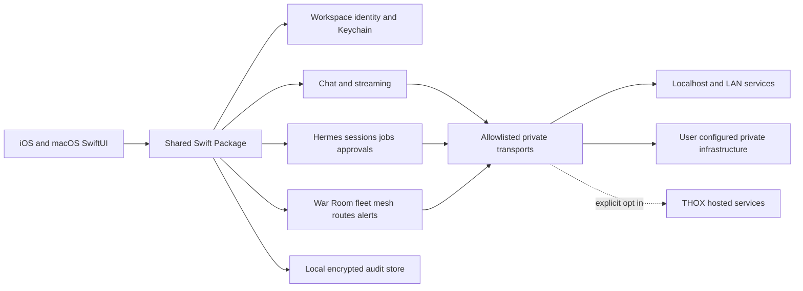

# ThoxWarRoom Ecosystem Map

Last updated: 2026-08-23

## Product vision

ThoxWarRoom is the native Apple command center for private THOX.ai workspaces: local/private chat, Hermes agent review and control, device/mesh health, and auditable operator actions from iPhone and Mac.

## Personas and workflows

- **Operator:** monitors fleet, mesh, routes, alerts, and active Hermes runs.
- **Knowledge worker:** chats with private models and documents with source provenance.
- **Approver:** reviews tool calls, automations, and other high-impact agent actions.
- **Administrator:** configures endpoints, trust, roles, retention, and exportable audit evidence.
- **Developer:** diagnoses services, sessions, streams, and local integration health.

## Target architecture

## Core modules

| Module | Responsibility | Local-first boundary |
|---|---|---|
| App Shell | Navigation, lifecycle, scene/window state | No network decisions |
| Workspace Identity | Endpoint profiles, credentials, trust policy | Credentials in Keychain; metadata local |
| Transport | HTTP/WebSocket/SSE, TLS, retry, cancellation | Deny unknown hosts; cloud profiles explicit |
| Chat | Conversations, streaming, citations, attachments | Local persistence; provider abstraction |
| Hermes | Capabilities, sessions, jobs, approvals, schedules | Mutations require review and audit |
| War Room | Fleet, mesh, route and alert aggregation | Direct private connections where feasible |
| Documents/RAG | Ingestion, parsing, indexing, retrieval | Local processing and storage by default |
| Audit | Append-only security and operator events | Local encrypted store with export controls |
| Platform Adapters | iOS share/App Intents; macOS Spotlight/menu commands | Least-privilege OS capabilities |

## Current architecture

The current v4.2 app is a shared SwiftUI shell that embeds `https://webui.thox.ai` in a persistent `WKWebView`. It has no native workspace, Hermes, War Room, local persistence, audit, or local model modules.

## Integration points

- Open WebUI-compatible servers
- Hermes Agent service
- ThoxRoute-compatible model routing
- THOX fleet health endpoints
- Mesh gateway service (native apps consume a stable gateway API; they do not parse raw serial frames directly in the first MVP)
- Apple Keychain, App Intents/share extensions on iOS, and Spotlight-style window controls on macOS

## Future architecture rules

- No hosted endpoint is silently selected.
- Each workspace declares its endpoint, trust mode, data boundary, and allowed capabilities.
- Provider-specific DTOs terminate at adapters; domain models remain shared and testable.
- All high-impact Hermes actions carry request, decision, actor, time, result, and correlation identifiers.
- Platform features depend on shared use cases, not directly on transport clients.
