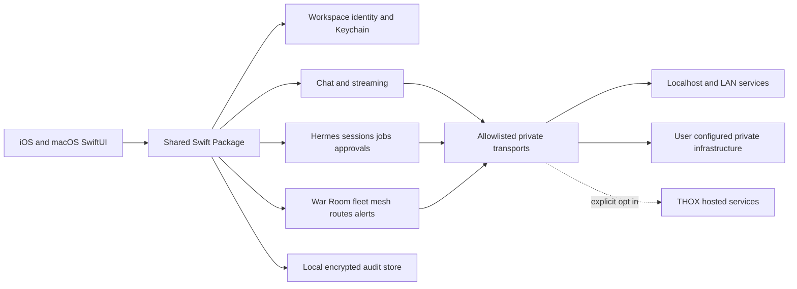

# ThoxWarRoom Ecosystem Map

Last updated: 2026-08-23

## Product vision

ThoxWarRoom is the native Apple command center for private THOX.ai workspaces: local/private chat, Hermes agent review and control, device/mesh health, and auditable operator actions from iPhone and Mac.

## Personas and workflows

- **Operator:** monitors fleet, mesh, routes, alerts, and active Hermes runs.
- **Knowledge worker:** chats with private models and documents with source provenance.
- **Approver:** reviews tool calls, automations, and other high-impact agent actions.
- **Administrator:** configures endpoints, trust, roles, retention, and exportable audit evidence.
- **Developer:** diagnoses services, sessions, streams, and local integration health.

## Target architecture



## Core modules

| Module | Responsibility | Local-first boundary |
|---|---|---|
| App Shell | Navigation, lifecycle, scene/window state | No network decisions |
| Workspace Identity | Endpoint profiles, credentials, trust policy | Credentials in Keychain; metadata local |
| Transport | HTTP/WebSocket/SSE, TLS, retry, cancellation | Deny unknown hosts; cloud profiles explicit |
| Chat | Conversations, streaming, citations, attachments | Local persistence; provider abstraction |
| Hermes | Capabilities, sessions, jobs, approvals, schedules | Mutations require review and audit |
| War Room | Fleet, mesh, route and alert aggregation | Direct private connections where feasible |
| Documents/RAG | Ingestion, parsing, indexing, retrieval | Local processing and storage by default |
| Audit | Append-only security and operator events | Local encrypted store with export controls |
| Platform Adapters | iOS share/App Intents; macOS Spotlight/menu commands | Least-privilege OS capabilities |

## Current architecture

The current v4.2 app has a dependency-free Shared Core plus native SwiftUI workspace onboarding for local-device, private-network, and explicitly consented hosted profiles. It encrypts multiple validated profile payloads with AES-256-GCM, stores per-workspace master keys in the non-synchronizing device-only Keychain, atomically persists ciphertext in the app container, and revalidates provider identity and endpoint policy on every decode instead of trusting persisted capabilities. Operators can explicitly switch the active workspace; deleting it erases only its scoped credential/profile material and persists a deterministic fallback only after decrypting and revalidating a remaining profile. A device-only Keychain journal makes credential-first workspace deletion resumable. Native routing selects Open WebUI, Hermes, or MeshStack by exact provider identity and required capability. Open WebUI has bounded discovery, protected model-catalog UI, and a strict offline qualifier for nine authenticated native-chat contract categories; its manifest records none captured. Hermes has bounded read-only run review, encrypted one-shot operation evidence/reconciliation, a human-review mutation surface, and an offline 11-category qualifier currently at 0/11. The production host injects neither authorization nor an executor. MeshStack has a read-only devices/topology/events dashboard plus an offline 10-category qualifier currently at 0/10. All three provider claims therefore remain fail-closed pending sanctioned evidence. Local-device workspaces can open an explicitly selected confined read-only text browser with descriptor-relative no-follow access and strict bounds. The Apple audit store encrypts workspace ledgers, revalidates redaction, chains ordered entries, serves bounded digest-bound pages, anchors crash-safe retention generations in device-only Keychain, and produces bounded redacted integrity-verified exports. Its native Audit Center stores confirmed workspace policy in separately anchored encrypted state, never prunes on save/load, applies only after an exact foreground destructive confirmation, and sends an in-memory snapshot only to the system-selected export destination. The persistent `WKWebView` code remains exact-origin-restricted but is feature-disabled until hosted retention, embedded domains, and matching App Store privacy declarations are verified. Both Apple build 5 artifacts from pushed source `2c299ef` are valid, internally testing, and assigned to the THOX internal TestFlight group; App Store Connect reports only a build 4 iPad installation, not direct build 5 launch evidence. Authenticated native chat, authorized live Hermes mutation composition, encrypted chat/document history, direct physical runtime proof, and live private-service evidence remain in progress.

## Integration points

- Open WebUI-compatible servers
- Hermes Agent service
- ThoxRoute-compatible model routing
- THOX fleet health endpoints
- Mesh gateway service (native apps consume a stable gateway API; they do not parse raw serial frames directly in the first MVP)
- Apple Keychain, App Intents/share extensions on iOS, and Spotlight-style window controls on macOS

## Future architecture rules

- No hosted endpoint is silently selected.
- Each workspace declares its endpoint, trust mode, data boundary, and allowed capabilities.
- Provider-specific DTOs terminate at adapters; domain models remain shared and testable.
- All high-impact Hermes actions carry request, decision, actor, time, result, and correlation identifiers.
- Platform features depend on shared use cases, not directly on transport clients.

## Chat surface (WR-017 / WR-018)

**Parent product.** ThoxWarRoom is one of three THOX chat surfaces. The other
two are the ThoxMythos-9B Space (Next.js, the shipping product UI) and
`thoxos-ios` (SwiftUI, LAN-only companion to ThoxDevice hardware). All three
render the same conversational shapes; they must not look like three products.

**Upstream dependencies.**

| Dependency | What it supplies | Boundary |
|---|---|---|
| `docs/fixtures/current-service-contracts/chat-ux-golden.html` | The `blocks[]` wire contract and the F1–F6 interactions | Frozen by SHA-256; a fixture, never a runtime |
| ThoxMythos-9B Space `web/app/globals.css` + `web/components/chat/*` | Visual language and message anatomy | Read-only reference; no code is copied |
| `thoxos-ios` `Sources/ThoxDesign/ThoxTokens.swift` (generated) | Canonical token values | Currently mirrored by hand in `App/ThoxTheme.swift` — see the P2 item in `HANDOFF_NEXT_ITERATION.md` |
| `WarRoomOpenWebUI` → `OpenWebUIProvider.nativeChatContract` | The evidence gate that keeps remote chat fail-closed | The surface reads it; it never bypasses it |
| `WarRoomCore` → `WorkspaceProfile`, `NetworkBoundary` | Workspace identity and the declared data boundary | Displayed verbatim in the header and empty state |

**Internal layering.** Presentation depends downward only:

```
WarRoomChatPreviewHost / …PreviewView       (SwiftUI, platform layout)
  └─ WarRoomChatPreviewModel                (@MainActor state, engine selection)
       ├─ ChatTransport                     (scripted | on-device | fail-closed provider)
       └─ WarRoomChatStreamParser           (raw text → [ThoxBlock])
  └─ ChatBlockView                          (dispatch, one arm per case)
       └─ WarRoomChatRichRenderers          (rich bodies)
            ├─ ThoxMarkdownDocument         ┐
            ├─ ThoxSyntaxHighlighter        ├─ Foundation-only, no UI, unit-testable
            └─ MermaidFlowchart             ┘
```

**Downstream consumers.** None yet inside the app. `ThoxBlock` is the seam a
future qualified remote transport hydrates, and the seam a share extension or
App Intent would render into.

**Data boundaries.**

- The presentation path performs no I/O. `scripts/verify_chat_ux_parity.py`
  fails the build if it acquires a network API.
- The only web view in the chat path renders documents composed on-device,
  through a non-persistent data store, with every navigation cancelled except
  the initial `about:blank` seed and `window.open` refused.
- Remote chat stays disabled until the WR-004 authenticated capture is reviewed.
  Until then the surface names the blocker and lists the missing evidence rather
  than offering a Send button that drops the request.
